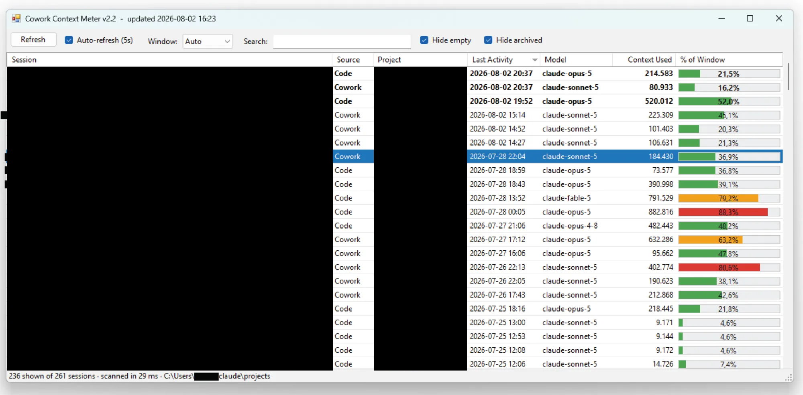

# Cowork Context Meter

A standalone Windows app that shows **how much of the context window each of
your Claude sessions has used** — read straight from the session files Claude
already writes to disk.

Claude Code has a built-in context counter; the **Claude desktop app doesn't**
surface one the same way. This fills that gap, showing every session's token
usage as a sortable list with a colour-coded percentage bar.



*Session titles and project names are blacked out in this screenshot only —
the app shows them normally.*

---

## ⚠️ Important: Cowork sessions are only readable when **cloud is disabled**

A Cowork session can run in one of two places, and it makes all the difference:

| Cowork session type | Runs on | Readable by this app? |
|---|---|---|
| **Local** (cloud disabled) | your PC | ✅ **Yes** — exact per-turn tokens |
| **Cloud** (`claude.ai/cowork/cse_…`, tagged "Cloud" in the UI) | Anthropic's servers | ❌ No |

**Cloud sessions execute remotely and write no transcript to your machine**, so
there is nothing on disk to measure. Only the session's *space memory* files
sync down — no messages, no token counts.

**So: turn cloud off for Cowork sessions you want to track.** A local session
writes a normal transcript with per-turn `usage` data, and this app reads it
exactly and reliably — no workarounds involved.

> This was verified the hard way. Every other avenue for cloud sessions was
> checked and is a genuine dead end: the VM disk (scanned twice, holds no token
> values at all), the app's local web storage, any local port, and Claude
> Desktop's own accessibility tree — which exposes a context readout on the
> Claude Code surface but not on Cowork.

## Features

- **All your sessions in one list** — title, project, source (Code / Cowork),
  model, last activity, tokens used, and **% of the context window**
  (green < 60%, amber 60–80%, red > 80%)
- **Live sessions** are badged, and **Auto-refresh (5s)** lets you watch a
  running session's context climb while you work
- **Double-click any session** for the full token breakdown (input / cache
  read / cache creation / output) and its context growth history
- **Surface-aware window sizing** *(new in v2.2)* — Cowork runs a smaller
  context window than other surfaces, so the percentage is now meaningful
  instead of running past 100% (see below)
- **Daemon/background jobs** are recognised and shown with their real name
- Search, hide-empty and hide-archived filters, sortable columns
- **Resilient across restarts/updates**: keeps a small private snapshot of your
  last-seen sessions, so opening the meter right after a reboot or a Claude
  Desktop update shows them immediately (flagged "showing last known") instead
  of an empty list, then refreshes to live data
- **Safe by design**: only ever *reads* your Claude session files (shared-read
  mode, never locks or modifies them), and no network access. The one thing it
  writes is its own cache at
  `%LOCALAPPDATA%\CoworkContextMeter\cowork-cache.json`

## How to use

1. Download **`CoworkContextMeter-portable.zip`** from
   [Releases](../../releases) and extract it anywhere on a Windows 10/11 PC.
2. Double-click **`CoworkContextMeter.exe`**. No installer, no admin rights,
   nothing else to download — it uses the .NET Framework already in Windows.
3. If SmartScreen warns about an unsigned download, click
   **More info → Run anyway**.
4. List looks empty? Run **`Diagnose.exe`** — it prints which Claude data
   folders exist on that machine and what was found in them.

## Context windows and auto-compaction

Auto-compaction fires at a **fixed reserve below the window**, not a
percentage:

```
compaction point = window − 33,000
                   (20,000 output reserve + 13,000 headroom)
```

Verified three independent ways: the Claude Code CLI bundle, live client
telemetry (`1,000,000 → 967,000` and `967,000 → 934,000`), and nine measured
compaction events on a 200k model (which fired at 167,287–171,567).

**Cowork gets a smaller window than other surfaces.** The CLI carries a
per-model table keyed by surface:

| Model | Cowork surface | Other surfaces |
|---|---|---|
| `claude-sonnet-5` | **500,000** | 967,000 |

So a Cowork sonnet-5 session compacts near **467,000**, not 967,000. Before
v2.2 the app assumed 200k for these sessions and displayed over 100% once they
passed 200,000 tokens. *(The 500,000 figure comes from the CLI bundle and is
not independently confirmed; the `window − 33,000` rule is.)*

**Practical takeaway:** the model picker is the real lever — a 1M-class model
gives roughly six times the runway of a 200k one, with nothing to install and
nothing to break.

## How it works

Claude stores each session as a JSONL transcript, plus (for desktop sessions) a
small state file. The app resolves these per Windows user — no fixed paths:

| What | Where it lives |
|---|---|
| Session transcripts | `%USERPROFILE%\.claude\projects\` |
| Background/daemon jobs | `%USERPROFILE%\.claude\jobs\` |
| Cowork sessions (local) | `…\Claude\local-agent-mode-sessions\` |
| Desktop session state (title, model, `[1m]`) | `…\Claude\claude-code-sessions\` |

A session's current context is the token usage on its **latest assistant
turn**: `input + cache_read + cache_creation + output`. After a compaction the
number drops automatically.

**The packaged-app trap (important if you're modifying this).** Claude Desktop
is an **MSIX-packaged app**, so its data is *not* in the real `%APPDATA%\Claude`
— it lives under:

```
%LOCALAPPDATA%\Packages\Claude_<publisherid>\LocalCache\Roaming\Claude\
```

The app globs for that package folder. This detail caused several false
diagnoses during development: a shell launched *by* Claude resolves paths
*into* the container automatically, so everything looks fine from there, while
the same program launched from Explorer sees the real, empty `%APPDATA%`.
**Always test by launching from Explorer, not from a Claude-spawned shell.**

**If the list suddenly shows no Cowork sessions**, check which build is running
before suspecting anything else — the window title carries the version and
build time (`Cowork Context Meter v2.2 - updated …`). A stale copy launched by
an old Startup shortcut will silently report zero Cowork sessions.

Under the hood it also handles Cowork's 270–470-character sandbox paths, which
exceed the Windows path limit that is still off by default — no registry
changes needed.

## Building from source

No SDK needed — it compiles with the C# compiler that ships inside Windows:

```powershell
powershell -ExecutionPolicy Bypass -File .\build.ps1
```

- `src/` — `Scanner.cs` (core logic), `App.cs` (WinForms UI),
  `TestScanner.cs` (test harness), `Diagnose.cs` (the diagnostic shipped in the
  portable zip)
- The [release zip](../../releases) is the prebuilt package: both exes plus its
  own source and build script.

The source is deliberately **C# 5 only**, because that's what the built-in
.NET Framework compiler (`csc.exe`) understands.

## Contributing

Found a bug? **Everyone is welcome to fix it** — open an
[issue](../../issues) describing what went wrong, or send a pull request.
Small fixes, big fixes, all appreciated.

One request: please don't submit changes that read another application's
browser cache or other private storage to extract session data. An earlier
unreleased build did exactly that to reach cloud Cowork sessions; antivirus
correctly flagged it as infostealer-shaped behaviour, and it was dropped. If
cloud Cowork usage becomes available through a supported interface, that would
be a very welcome contribution.

---

> Originally built by **Claude (Fable 5)**, June 2026. Compatibility work from
> v1.1 onward — storage-layout fixes, the MSIX container discovery, and the
> local-vs-cloud investigation behind the note at the top — by
> **Claude (Opus 4.8 / Opus 5)**.
